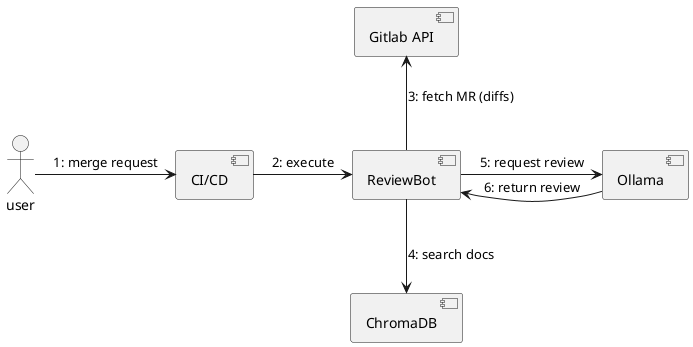
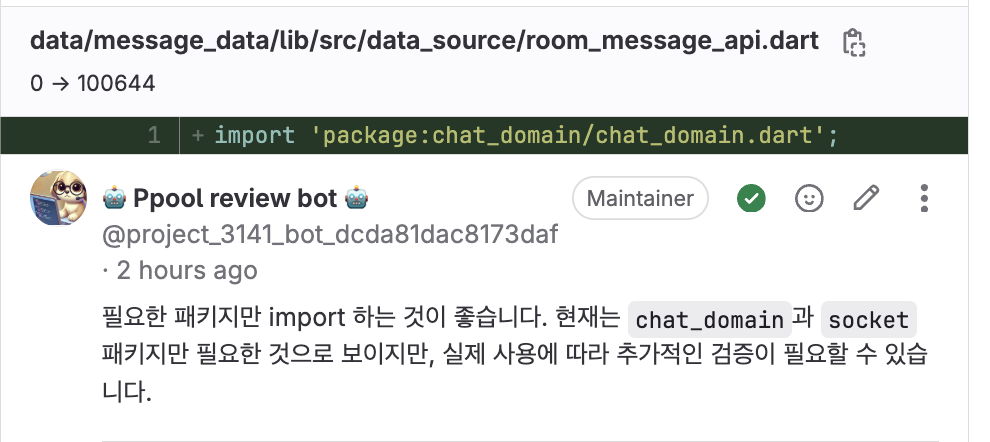
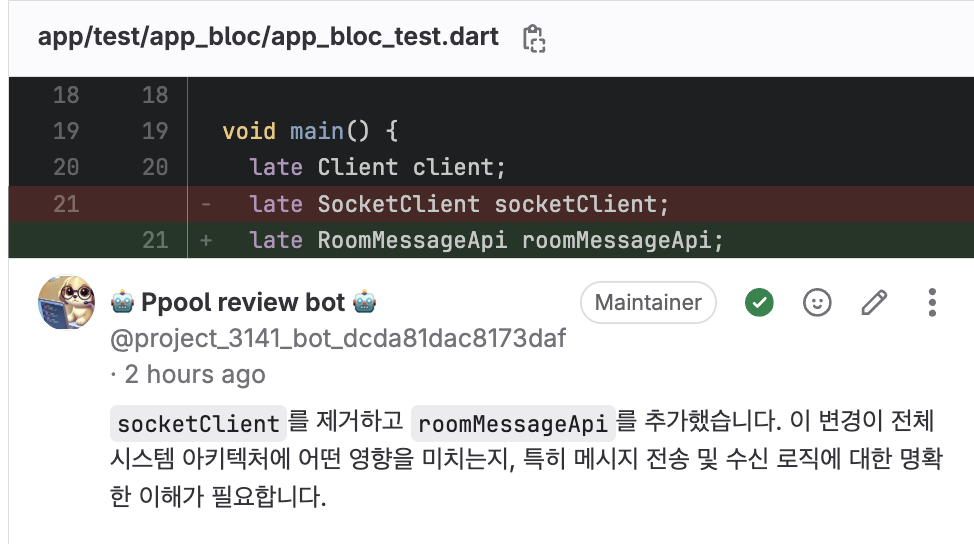

# Ollama를 활용하여 사내 코드 리뷰 자동화 시스템 구축하기

## 1. 소개 (Introduction)

### 배경 및 필요성

 기존 수동으로 진행되고 있는 코드 리뷰 시스템에 LLM 기반 자동 코드 리뷰 시스템이 추가된다면, 리뷰어의 부담도 줄고 코드 리뷰의 퀄리티도 증가할 것이라고 판단되어 LLM 코드 리뷰 시스템 개발을 진행하게 되었습니다.

처음에는 OpenAI의 API를 활용하여 시스템 구축을 시도했으나 다음과 같은 몇 가지 주요 문제가 발생하였습니다.

- **보안 이슈** : 오픈 AI에 따르면 API 호출의 경우 별도로 데이터를 학습하지 않지만, 그럼에도 불구하고 회사 내부 코드가 외부 API로 전송되는 것에 대한 보안 부담이 존재합니다.
- **비용 문제** : API 호출이 많아질수록 운영 비용이 증가합니다. Free tier 진행 시 Rate Limit 문제가 빈번히 발생하였고 재시도 로직을 추가하였음에도 전체 MR에 대한 리뷰를 보장하기 어려웠습니다. Tier를 높이면 이런 문제가 일정 부분 해소될 수 있겠지만, 비용 부담이 발생합니다. 마일스톤 내 대규모 기능 개발이 포함된다면 이러한 부담은 점점 커집니다.

이러한 문제를 해결하기 위해, 오픈 소스 LLM 모델을 활용하여 사내 로컬 환경에서 코드 리뷰 자동화 시스템을 구축하는 방법을 선택하게 되었습니다. Ollama를 사용하면 다양한 오픈 소스 LLM을 쉽게 로드하고 내부 서버에서 실행할 수 있기 때문에 보안성과 비용 절감 측면에서 유리합니다.

### 본 글의 목적

본 글에서는 Ollama 기반의 코드 리뷰 자동화 시스템 구축 과정을 공유하고, CI/CD와의 연동 방법 및 실제 운영 시 발생한 문제와 해결 방법에 대해 설명합니다. 또한, RAG(Retrieval-Augmented Generation) 방식을 활용하여 사내 여러 가이드 문서를 검색할 수 있도록 개선한 사례를 다룹니다.

----------

## 2. Ollama와 오픈 소스 모델 살펴보기

### Ollama란?

Ollama는 다양한 오픈 소스 LLM 모델을 손쉽게 다운로드하고 실행할 수 있는 프레임워크로, 주요 기능은 다음과 같습니다.

- 다양한 LLM(llama, gemma, deepseek 등)을 지원
- 로컬 환경에서 모델 실행 가능

### 오픈 소스 모델 선택 기준

팀의 코드 리뷰 시스템에 적합한 모델을 선택하기 위해 아래 기준을 적용하였습니다. PoC 단계에서 오픈 소스 모델은 7B 파라미터의 경량 모델을 기준을 사용하였으며, 이러한 경량 모델에서의 성능을 고려했을 때 다음과 같은 기준으로 모델을 선정하였습니다.

| 모델명  | 특징  | 한국어 이해도 | dart 코드 이해도 |
| ---------- | ------------- | ------ | ----- |
| **exaone** | LG의 오픈 소스 LLM| 높음 |  준수 |
| **gemma**  | 구글의 경량 오픈소스 모델 | 보통 | 낮음~보통  |
| **codellama** | 메타의 코딩 특화 오픈 소스 LLM | 낮음 | 낮음  |

- **선정 모델**: `exaone` (한국어 지원이 강점이며, 코드 이해도도 준수하였음.)
선정 모델은 추후 변경 가능성이 있으며, 정성 테스트를 거쳐 최종 선정 예정입니다.

----------

## 3. Ollama 설치 및 모델 배포

### Ollama 설치 및 실행

#### 3.1. Ollama 설치

- ollama.com/download 에서 Ollama 설치

#### 3.2. 모델 실행

##### 3.2.1. Ollama cloud에서 지원하는 모델의 경우

```bash
ollama pull codellama
ollama run codellama
```

##### 3.2.2. 커스텀 된 모델을 적용하려는 경우

##### 3.2.2.1. gguf 확장자 모델 설치

```bash
# (optional) install huggingface_hub
pip install huggingface_hub

# Download the GGUF weights
huggingface-cli download LGAI-EXAONE/EXAONE-3.5-7.8B-Instruct-GGUF \
    --include "EXAONE-3.5-7.8B-Instruct-BF16*.gguf" \
    --local-dir .
```

##### 3.2.2.2. Modelfile 생성하여 gguf 파일 임포트

```bash
FROM ./EXAONE-3.5-7.8B-Instruct-BF16.gguf
```

##### 3.2.2.3. 모델 생성

```bash
ollama create model_name -f Modelfile
```

##### 3.2.2.4. 모델 실행

```bash
ollama run model_name
```

### CI/CD

```yml
ai-reviewer:
  stage: 'ai-review'
  extends: .default-python-job
  rules:
    - if: '$CI_PIPELINE_SOURCE == "merge_request_event"'
  script:
    - python3 ./script/ai-code-review/main.py
```

## 4. 코드 리뷰 자동화 시스템 개요

### 시스템 목표 및 범위

본 시스템을 구축하기에 앞서, 다음과 같은 목표를 수립하였습니다.

1. **코드 스멜 감지**: 불필요한 변수, 중복 코드 탐지하여 코드의 퀄리티 향상
2. **리팩토링 제안**: 가독성 개선, 성능 최적화 제안
3. **최적화**: CI 시스템 내 빠른 코드 통합을 위한 실행 속도 최적화

### 주요 구성 요소

- **Ollama 서버**: LLM을 로컬 빌드 머신에 호스팅
- **CI/CD 파이프라인**: MR 발생 시 Ollama에 요청
- **ChromaDB**: 사내 문서를 검색하여 가이드 제공

### 전체 다이어그램



----------

## 6. 프롬프트 엔지니어링

원하는 결과를 더 정확하게 잘 이끌어내는 것을 목표로 프롬프트를 디자인하는 것을 프롬프팅이라고 합니다. 다음과 같은 여섯 가지 구성 요소로 프롬프트를 설계하였습니다.

### 1. **역할 정의(Role)**

AI의 페르소나 또는 역할을 정의합니다. 역할을 명확히 정의함으로써 어떤 태도나 전문성을 가지고 적합하게 응대해야 하는지를 설정합니다.

> 당신은 숙련된 **Flutter/Dart 소프트웨어 엔지니어**입니다.

### 2. 수행해야 할 작업 명시

수행해야 하는 특정 작업이나 목표를 설정합니다.

> 당신은 숙련된 Flutter/Dart 소프트웨어 엔지니어입니다.
> **다음 코드 변경 사항을 검토하고, 잠재적인 문제점 또는 개선 사항을 제안해주세요.**
> gitlab issue, mr description 등을 종합적으로 검토하여 의미있는 리뷰를 제안해주세요.

### 3. **지식과 정보 제공**

질문과 관련해서 참고할 만한 지식과 정보를 제공합니다. 해당 시스템은 `코드 리뷰`를 목적으로 하므로, 작성한 코드의 배경을 잘 이해할 수 있도록 Gitlab API를 통해 가져온 MR의 본문과 MR에 대응되는 issue의 본문을 컨텍스트로 제공하였습니다. 또한, RAG 기법을 활용하여 임베딩된 문서를 참고할 수 있도록 하였습니다.

> **gitlab issue, mr description 등을 종합적으로 검토하여** 리뷰를 제안해주세요.
> - 다음은 **이슈의 description**입니다:
> ...이슈 본문...
> - 다음은 **MR의 description**입니다:
> ...MR 본문...
> - 다음은 **Reference docs**입니다:
> ...Effective dart...

### 4. 정책 및 규칙, 스타일 가이드, 제약 사항 설정

응답을 만들 때 따라야하는 특정 정책이나 규칙, 스타일 가이드, 제약 사항을 설정합니다. 이는 일관된 응답을 만들어 원하는 방식으로 정보를 제공하도록 합니다.

> - comment의 경우, 참조한 docs가 존재하는 경우 출처를 밝혀주세요 (예: Effective Dart).
> - 코드 변경이 사소한 경우 (예: 변수 이름 변경, 포맷팅), 리뷰를 건너뛰어주세요.
> - 제공된 코드 변경 외의 컨텍스트가 부족하거나, 리뷰가 변경된 라인의 직접적인 내용과 무관한 경우, 리뷰를 생략하세요.
> - 제공된 코드에서 '+'로 시작하는 라인은 추가된 코드, '-'로 시작하는 라인은 삭제된 코드, 공백으로 시작하는 라인은 컨텍스트 코드입니다. 리뷰는 '+' 라인에 대해서만 작성하며, '-'와 컨텍스트 라인은 참고용으로만 사용하세요.
> - 변수가 정의되어 있는지 여부는 주어진 코드에 명시되지 않은 경우 판단하지 마세요.

### 5. 형식 및 구조 설정

응답이 따라야 하는 특정 구조를 설정합니다.

> - 응답은 마크다운을 포함하지 않는 JSON 형식으로만 생성하세요. 아래 구조를 따라주세요.
[ { "new_line": int, "comment": "review comment" }, ... ]
> - json의 key는 'new_line', 'comment' 두 가지만 포함합니다.

### 6. **출력 예시 제공**

원하는 응답 형식을 구체적으로 보여주는 예시를 제공합니다. 

```bash
[
    {
          "new_line": 87,
          "comment": "`transmission.addAll(receiver)`가 호출되는 클로저 내부의 논리를 검토합니다. 특히 여러 멤버가 관련된 경우 이 작업이 의도치 않게 다른 스트림의 데이터를 덮어쓰거나 잘못 정렬하지 않도록 주의하세요."
    },
    {
         "new_line": 91,
         "comment": "The `_intensitiesSubscription` is initialized inside `_listen` but should be scoped appropriately to ensure it is only active when needed. Consider if this subscription should be managed differently based on the context (e.g., per memberNo)."
    },
    {
          "new_line": 97,
          "comment": "Similar to the comment on line 91, `_volumeSubscription` should be managed carefully to avoid memory leaks or unintended cancellations. Ensure that subscription management aligns with the lifecycle of receiver operations."
    }
]
```

## 7. RAG(Retrieval-Augmented Generation) 적용

RAG 기술을 적용하여 모델이 사전 학습된 지식에만 의존하는 대신, 실시간 또는 특정 도메인의 데이터를 활용해 더 정확하고 맥락적인 응답을 생성할 수 있습니다. 팀의 스타일에 맞는 코딩 컨벤션 / 아키텍처 설계도 등의 문서가 존재할 경우, 이러한 문서를 참고하게끔 한다면 조금 더 맥락있는 리뷰가 가능할 것입니다.

### 7.1. 검색 단계 (Retrieval)

- **지식 기반 준비**: 외부 데이터(예: 문서, 웹 페이지, 데이터베이스)를 미리 인덱싱합니다. 이를 위해 벡터 저장소(Vector Store, 예: FAISS, Pinecone, Chorma)를 사용해 텍스트를 임베딩(Embedding)으로 변환합니다.
  - 임베딩은 사전 학습된 모델(예: BERT, Sentence-BERT)로 생성되며, 의미적 유사성을 기반으로 저장됩니다.
- **쿼리 처리**: 사용자가 질문을 입력하면, 이를 임베딩으로 변환해 지식 기반에서 관련 문서를 검색합니다.
  - 예: "Flutter에서 상태 관리 방법은?" → 관련 문서(Flutter 공식 문서, 튜토리얼)가 검색됨.
- **랭킹**: 검색된 문서 중 상위 𝑘개를 선택해 생성 단계로 전달하고, 코사인 유사도나 다른 메트릭을 사용해 랭킹.

### 7.3 생성 단계 (Generation)

- **프롬프트 증강**: 검색된 문서를 원래 질문과 결합해 프롬프트로 만듭니다.
  - 예: "다음 문서를 기반으로 답변하세요: [검색된 문서]
- **LLM 활용**: 증강된 프롬프트를 LLM에 입력해 응답을 생성합니다.

RAG 기능을 강화하기 위한 다양한 방법이 있지만, 현재 수준에서는 `검색` -> `생성 단계` 정도만을 활용한 기본적인 형태를 적용하였습니다. 

----------

## 8. 마주한 문제점들

### 8.1 무작위 응답값

생성된 응답을 적절히 활용하기 위해서는 LLM이 일관된 형태의 JSON으로 응답값을 생성해 줄 필요가 있었습니다. 다수의 조건을 명확하게 명시했음에도 불구하고 JSON 형식 이외의 응답을 뱉는 경우가 빈번했습니다.

예를 들면 다음과 같은 잘못된 응답이 빈번하게 발생하였습니다.

#### 8.1.1. Markdown 형태의 응답값

markdown을 포함하지 않은 json 형식의 응답값을 생성할 것을 요구했으나, 적지 않은 빈도로 다음과 같은 응답을 생성했습니다.

```markdown
#### 리뷰 내용
1. **새로운 도메인 패키지 추가 (라인 17)**
   - **라인:** 17
   - **코멘트:** `room_domain` 패키지를 추가함으로써 도메인 로직과 데이터 처리 로직을 명확히 분리하려는 의도가 보입니다. 이 변경이 데이터 소스와 관련된 로직을 효과적으로 이관하는 데 도움이 되는지 확인해야 합니다. 특히, `room_domain` 내의 클래스와 메서드들이 기존 로직과 잘 통합되어 있는지 검토해 보세요. 또한, 이 패키지의 도입이 향후 유지보수와 확장성에 어떤 영향을 미칠지 고려해 보세요.

[
    {
        "new_line": 17,
        "comment": "새로운 `room_domain` 패키지를 추가하여 도메인 로직을 분리하는 것은 좋은 접근입니다. 이 패키지 내의 구현이 기존 데이터 처리 로직과 원활하게 통합되었는지, 그리고 향후 유지보수와 확장성 측면에서 효과적인지 확인해 보세요."
    }
]

### 추가 검토 사항
1. **Rx 적용 및 Subject 사용:**
   - `XXsubject`로의 변경이 실제 데이터 흐름과 반응성에 어떤 영향을 미치는지 확인해야 합니다. 특히, 구독 관리와 스트림 처리 로직이 올바르게 구현되었는지 검토해야 합니다.
2. **데이터 소스 분리:**
   - 요청, 응답, 알림 로직이 명확하게 분리되었는지 확인합니다. 각 데이터 소스가 독립적으로 동작하면서도 필요한 경우 적절히 상호작용하는지 확인해야 합니다.
3. **테스트 커버리지:**
   - 변경된 부분에 대한 테스트 케이스가 추가되었는지 확인합니다. 특히, 새로운 데이터 소스 구조와 Rx 적용 부분에 대한 테스트가 충분히 포함되어 있는지 검토해야 합니다.

이러한 점들을 중심으로 추가적인 코드 검토와 테스트를 진행하시면 좋을 것 같습니다. 추가적인 코드 변경 사항이 있다면 그에 따른 세부적인 리뷰를 제공하겠습니다.
```

#### 8.1.2. 요구 사항 이외의 json key를 포함하는 response

json key는 `new_line`, `comment`만을 포함하는 Array 형식의 json 형태를 요구했으나 아래와 같이 임의적으로 key를 생성하여 응답을 생성했습니다.


```json
{
  "review_points": [
    {
      "line": 32,
      "comment": "생성자에서 io 객체 초기화 시, 에러 처리를 추가하는 것이 좋습니다. 연결 실패 시 적절한 로깅이나 예외 처리가 필요합니다."
    },
    {
      "line": 59,
      "comment": "소켓 연결 후 로그인 재시도 로직이 주석 처리되어 있습니다. 필요에 따라 구현하거나 주석을 명확히 하는 것이 좋습니다."
    },
    {
      "line": 78-82,
      "comment": "이제 `_setState` 메서드가 사용되지 않으므로 삭제하는 것이 좋습니다. 상태 업데이트 로직이 `_stateSubject.add`를 통해 처리되고 있습니다."
    }
  ],
  "summary": "주요 변경 사항은 Rx 스트림을 사용한 상태 관리로 인해 기존의 `_state`와 `_stateStreamController`를 `_stateSubject`로 통합하는 방향으로 이루어졌습니다. 일관성 유지와 코드의 가독성을 위해 상태 체크와 업데이트 로직을 통일하는 것이 중요합니다. 또한, 예외 처리와 주석을 통해 코드의 명확성을 높이는 것이 좋습니다."
}
```

### 8.2. 의미없는 리뷰 양산





- **불필요한 가정**: 프롬프트에서 "코드 변경이 사소한 경우 리뷰를 건너뛰세요"와 "제공된 코드 변경 외의 컨텍스트가 부족하거나, 리뷰가 변경된 라인과 무관한 경우 리뷰를 생략하세요"라는 조건을 명시했으나, LLM은 이를 무시하고 추가적인 가정(예: 변수/파일 존재 여부 등)을 언급했습니다.
- **구체성 부족**: 리뷰 코멘트가 다소 일반적이여서 실질적으로 도움을 주지 못하는 경우가 많았습니다.

### 8.3 응답값 제어하기

다음은 기존 프롬프트의 전문입니다.

> 당신은 숙련된 Flutter/Dart 소프트웨어 엔지니어입니다.
> **다음 코드 변경 사항을 검토하고, 잠재적인 문제점 또는 개선 사항을 제안해주세요.**
> gitlab issue, mr description 등을 종합적으로 검토하여 의미있는 리뷰를 제안해주세요.
> 
> - 다음은 **이슈의 description**입니다:
> {issue_description}
> - 다음은 **MR의 description**입니다:
> {mr_description}
> - 다음은 **Reference docs**입니다:
> {docs}
> - comment의 경우, 참조한 docs가 존재하는 경우 출처를 밝혀주세요 (예: Effective Dart).
> - 코드 변경이 사소한 경우 (예: 변수 이름 변경, 포맷팅), 리뷰를 건너뛰어주세요.
> - 제공된 코드 변경 외의 컨텍스트가 부족하거나, 리뷰가 변경된 라인의 직접적인 내용과 무관한 경우, 리뷰를 생략하세요.
> - 제공된 코드에서 '+'로 시작하는 라인은 추가된 코드, '-'로 시작하는 라인은 삭제된 코드, 공백으로 시작하는 라인은 컨텍스트 코드입니다. 리뷰는 '+' 라인에 대해서만 작성하며, '-'와 컨텍스트 라인은 참고용으로만 사용하세요.
> - 변수가 정의되어 있는지 여부는 주어진 코드에 명시되지 않은 경우 판단하지 마세요.
> - 응답은 마크다운을 포함하지 않는 JSON 형식으로만 생성하세요. 아래 구조를 따라주세요.
[ { "new_line": int, "comment": "review comment" }, ... ]
> - json의 key는 'new_line', 'comment' 두 가지만 포함합니다.
> 리뷰할 코드입니다: {patch}

기존 프롬프트로부터 다음과 같은 문제점을 도출해보았습니다.

- **형식 지시의 강도가 약함**
  - "응답은 마크다운을 포함하지 않는 JSON 형식으로만 생성하세요"라는 지시가 있지만, LLM이 이를 우선순위로 인식하지 못했을 수 있습니다.
- **훈련 데이터 편향**:
  - LLM이 코드 리뷰와 같은 작업에서 일반적인 패턴(예: JSON 형태가 아닌 설명 + 리뷰 형식)을 학습하여, 더 광범위한 리뷰를 시도했을 가능성이 있습니다.
- **문맥 혼동**
  - 프롬프트에서 요구하는 정보가 많고 정돈되지 않아 모델이 혼란을 겪고 의도한 방식으로 답을 생성하지 못할 수 있습니다.

문제점을 토대로 먼저 프롬프트를 다음과 같이 개선하였습니다.

>  당신은 숙련된 Flutter/Dart 소프트웨어 엔지니어입니다.
다음 코드 변경 사항을 검토하고, 잠재적인 문제점 또는 개선 사항을 제안해주세요.
GitLab 이슈와 MR description을 참고하되, 코드 변경과 직접 관련된 리뷰만 제공하며, 지정된 JSON 형식으로만 응답하세요.
>
> 중요 지침:
> 
> 1. 응답 형식: 반드시 아래 구조의 JSON 배열로만 응답하세요. 이외의 부가적인 말은 포함하지 마세요.
[ {{ "new_line": int, "comment": "review comment" }}, ... ]
> 2. 리뷰 범위: '+'로 시작하는 라인에 대해서만 리뷰를 작성하세요.
> 3. 변수 / 클래스 등이 실제로 정의되어 있는지 여부는 주어진 코드에 명시되지 않은 경우 판단하지 마세요.
> 4. 모든 응답은 한국어로 작성해야 합니다.
>
> 입력 데이터:
> 
> - 이슈의 description: {issue_description}
> - MR의 description: 제목: {mr_title} 설명: {mr_description}
> - Reference Docs: {docs}
> - 코드 변경 사항: {patch}
>
> 예시 응답:
>
> [   {{ "new_line": 85, "comment": "`_zipIntensityStream`을 `_combinedIntensityStream`과 같은 더 구체적인 이름으로 변경하여 전송 및 수신 강도를 결합하는 목적을 명확히 나타내는 것을 고려해 보세요." }}, {{ "new_line": 87, "comment": "`transmission.addAll(receiver)`가 호출되는 클로저 내부의 논리를 검토합니다. 특히 이 작업이 의도치 않게 스트림의 다른 데이터를 덮어쓰거나 잘못 정렬하지 않도록 합니다." }}, ]
>
> 주의: 위 예시는 참고용이며, 응답은 반드시 주어진 코드와 조건에 맞게 생성해야 합니다.

프롬프트를 이해하기 쉽고 간결하게 수정하였으며, 추가로 LLM에게 구체적인 예시를 다양하게 제공하는 퓨샷 프롬프팅 기법을 적용하였습니다. 이를 통해 무작위 응답값이 기존 XX% 확률로 발생하던 것에서 XX%로 감소시킬 수 있었습니다.

----------

## 8. 결론 및 향후 계획

### 구축 결과

- 팀내 코드 리뷰 자동화 성공
- 비용 절감 및 보안 강화 효과
- CI/CD 및 RAG 연동으로 활용성 증대

### 향후 개선 방향

- **추가 기능 개발**: JIRA API와 연동하여 추가 문맥 제공
- **모델 개선**: Fine-tuning 및 대형 모델 활용
- **확장 적용**: 테스트 코드 제안 기능
