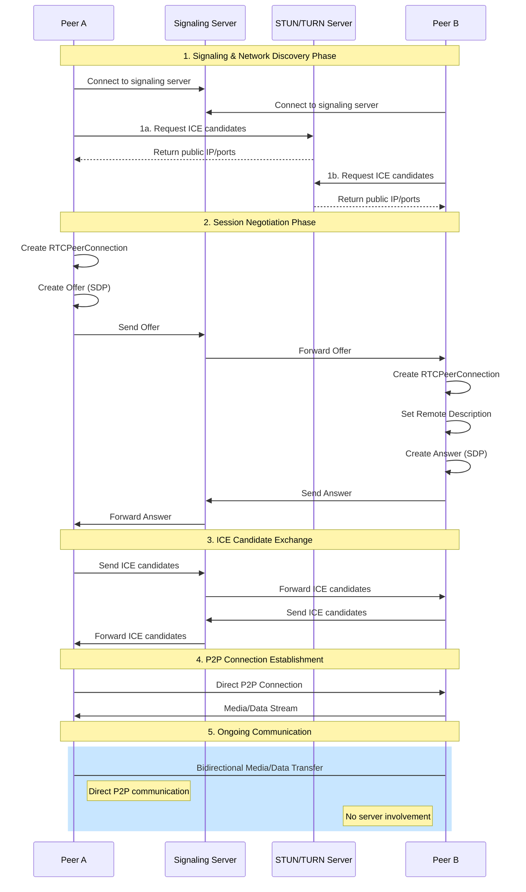
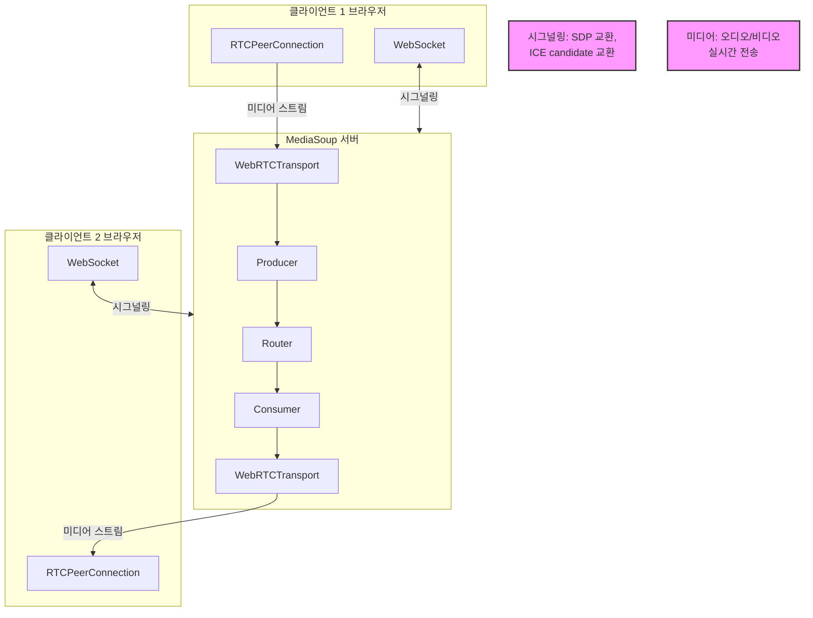
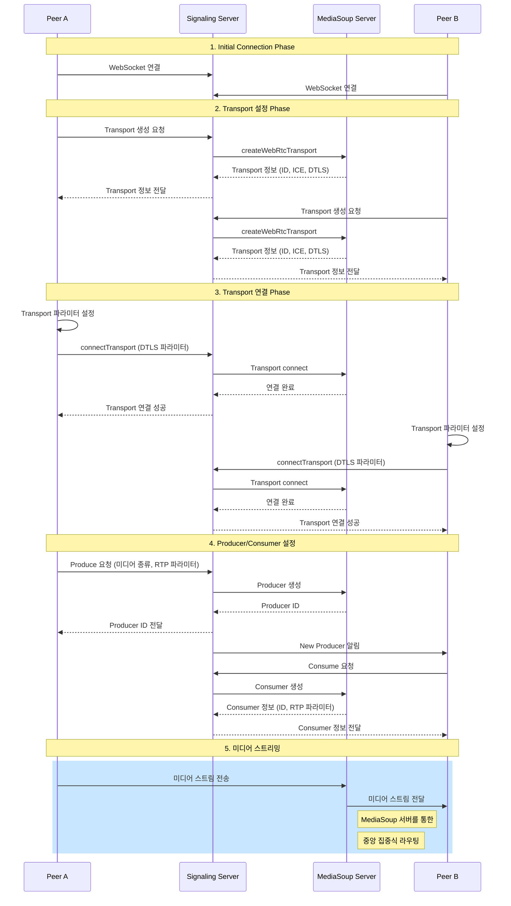
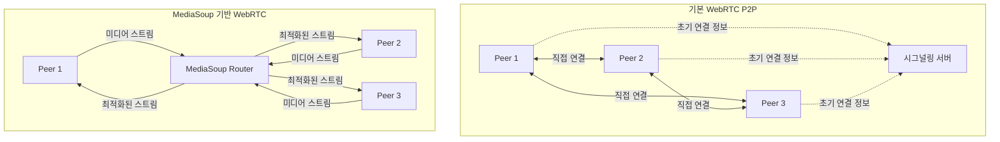

# WebRTC, MediaSoup

## WebRTC 기본 흐름

1. **Signaling & Network Discovery Phase**
   - 양쪽 피어가 시그널링 서버에 연결
   - `STUN / TURN 서버`를 통해 자신의 `공개 IP와 포트 정보` 획득

2. **Session Negotiation Phase**
   - Peer A가 `Offer SDP` 생성
   - 시그널링 서버를 통해 Peer B에게 전달
   - Peer B가 `Answer SDP` 생성
   - 시그널링 서버를 통해 Peer A에게 전달

3. **ICE Candidate Exchanged**
   - 양쪽 피어가 발견한 `ICE candidate` 정보를 교환
   - 시그널링 서버를 통해 상대방에게 전달

4. **P2P Connection Establishment**
   - 교환된 정보를 바탕으로 직접 연결 시도
   - 가장 적합한 연결 경로 선택

5. **Ongoing Communication**
   - 직접적인 P2P 통신 시작
   - 미디어 스트림이나 데이터 교환
   - 서버 개입 없이 진행
   - 이러한 연결 과정이 성공적으로 완료되면, 이후의 모든 통신은 시그널링 서버나 STUN/TURN 서버의 개입 없이 직접적으로 이루어지며 실패할 경우 TURN 서버를 통한 중계 방식으로 폴백된다.

- SDP 교환과 ICE Candidate 수집은 병렬적으로 진행된다.
- SDP는 **무엇을** 주고 받을 지에 대한 정보 (미디어 종류, 형식, 코덱 등)
- ICE는 **어떻게** 연결할 지에 대한 정보 (실제 통신 가능한 네트워크 경로)

## 용어 정의

- **RTCPeerConnection**
  - WebRTC에서 피어 간 연결을 담당하는 핵심 인터페이스
  - 두 피어 간의 안전한 실시간 데이터, 오디오, 비디오 통신을 가능하게 함
  - 이 인터페이스를 통해 `SDP (Session Description Protocol)`를 생성할 수 있으며 `ICE` 프레임워크를 사용하여 네트워크 경로를 탐색하고 최적의 경로를 선택할 수 있음
  - 다음과 같은 주요 기능 제공
    - 연결 상태 관리
    - 오디오/비디오 스트림 처리
    - 대역폭 관리
    - 암호화 처리
    - NAT 통과 및 방화벽 처리

- **SDP (Session Description Protocol)**
  - 미디어 세션의 초기화, 수정, 종료를 위한 표준 프로토콜
  - 연결하려는 피어들 간에 다음과 같은 정보를 교환
    - 미디어 종류 (오디오 / 비디오)
    - 코덱 정보
    - 대역폭 정보
    - 전송 프로토콜
    - IP 주소와 포트번호

- **ICE (Interactive Connectivity Establishment)**
  - NAT와 방화벽을 통과하여 피어 간 연결을 수립하기 위한 프레임워크
  - 다음과 같은 단계로 작동
    - 후보 수집: 로컬 IP, STUN 서버, TURN 서버를 통해 가능한 연결 경로 탐색
    - 우선 순위 지정: 최적의 연결 경로 선택
    - 연결 확인: 선택된 경로로 실제 연결 가능 여부 테스트
  - ICE 후보 유형
    - `Host candidates`: 로컬 네트워크 인터페이스
    - `Server reflexive candidates`: STUN 서버를 통해 얻은 공인 IP/포트
    - `Relay candidates`: TURN 서버를 통한 중계 주소

## MeidaSoup

- 다자간 WebRTC 애플리케이션에서 확장성, 유연성, 고성능을 제공하기 위한 미디어 서버
- `SFU (Selective Forwarding Unit)` 아키텍처를 기반으로 하며, 클라이언트와 서버 간의 작업 분담을 통해 효율적인 미디어 처리와 전달을 제공

### 아키텍처 구성

- `Router`: 미디어 라우팅의 핵심 컴포넌트로, Producer와 Consumer 간의 미디어 전달을 관리
- `Transport`: WebRTC 연결을 처리하는 컴포넌트
- `Producer`: 미디어를 생성하는 엔드포인트
- `Consumer`: 미디어를 소비하는 엔드포인트

### 통신 과정

### Transport?

- MediaSoup의 Transport는 WebRTC에서의 미디어 전송과 관련된 개념을 추상화한 것
- 다음과 같은 WebRTC의 핵심 개념들을 포함
  - `ICE`
  - `DTLS`: 미디어 스크림의 암호화 담당
  - `SRTP/SRTCP`: 실시간 미디어 전송을 위한 프로토콜

### P2P 기반 WebRTC와 MediaSoup 구성 방식 비교

|             | P2P                                                                                                                                              | MediaSoup                                                                                                                                     |
|-------------|--------------------------------------------------------------------------------------------------------------------------------------------------|-----------------------------------------------------------------------------------------------------------------------------------------------|
| 연결 방식   | - Peer-to-Peer 직접 연결 방식   - N명이 참여할 경우 N(N-1)/2개의 연결이 필요   - 참여자가 많아질수록 네트워크 부하가 기하급수적으로 증가 | - 중앙 서버(Router)를 통한 연결 방식   - N명이 참여할 경우 N개의 연결만 필요   - 참여자가 많아져도 효율적인 관리 가능                 |
| 리소스 사용 | - 각 피어의 대역폭과 CPU 자원을 많이 사용   - 참여자마다 인코딩된 스트림을 개별 전송   - 클라이언트 디바이스에 부하가 큼             | - 서버에서 스트림 처리와 전달을 담당   - 한 번의 인코딩으로 다수의 참여자에게 전달 가능   - 클라이언트 부하 감소, 서버 자원 활용  |

