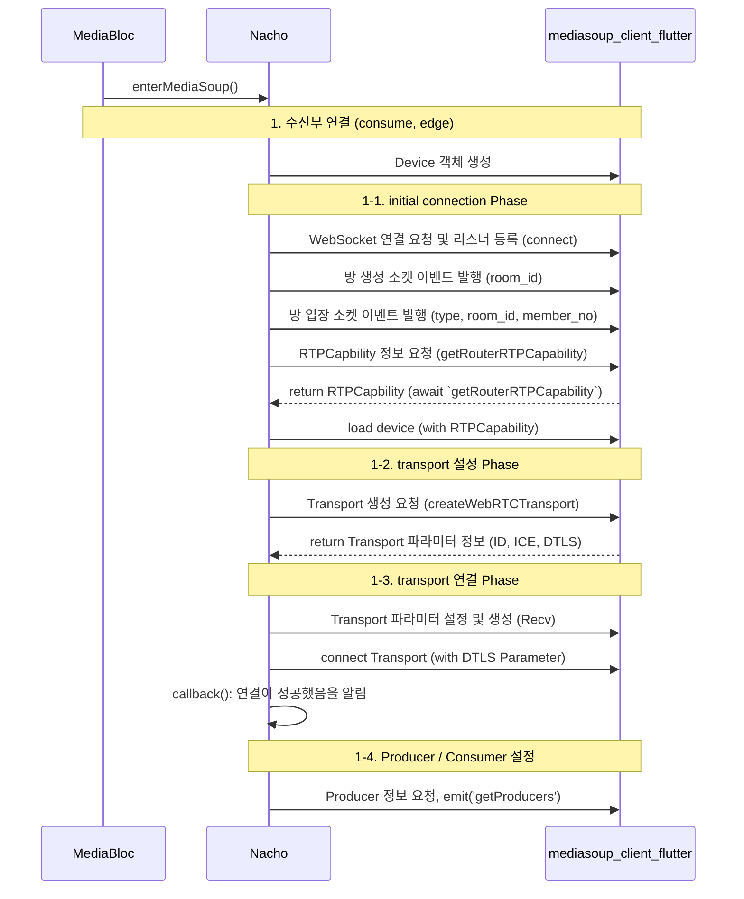

# MediaSoup

- `media_origin`: 나의 마이크, 비디오 스트림을 전송
- `media_edge`: 상대방의 마이크, 비디오 스트림을 수신

## enter room seqeunce

- WebSocket을 통해 주고 받는 정보들
  - SDP 정보 교환
  - ICE candidate 정보 교환
  - 룸 입장 / 퇴장 알림
  - 참가자 목록 관리
  - producer / consumer 정보
  - 미디어 설정 변경 요청 등
