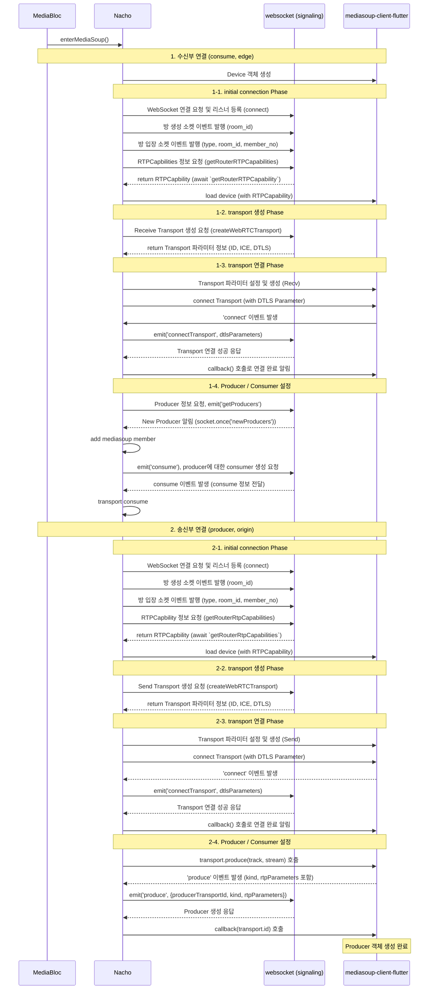
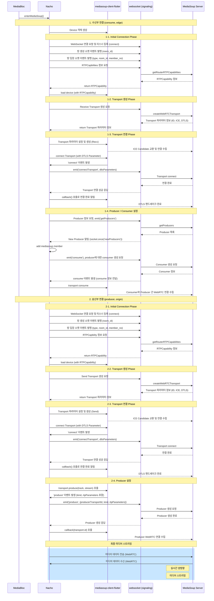

# MediaSoup

- `media_origin`
  - 주로 방송자나 발신자로부터 직접 미디어 스트림을 받는 서버
  - 원본 미디어 스트림을 처음으로 받아서 처리하는 역할
- `media_edge`
  - 상대방의 마이크, 비디오 스트림 수신 관리
  - origin 서버로부터 미디어를 받아서 최종 사용자에게 전달하는 서버

## Enter room seqeunce

#### Rtp Capabilites

- 전화기로 비유를 들자면, 전화기로 통화하기 전에 무슨 일이 일어날까?
- 영상통화가 가능한 전화기인지, HD 음성을 지원하는지, 어떤 압축 방식을 사용할 수 있는지 체크할 것임
- `Rtp Capabilities`도 이와 비슷한 목적으로 사용됨
  - 서로 지원하는 코덱(압축 방식)을 확인
  - 최적의 품질 설정을 결정
  - 호환되지 않는 설정 사용을 방지

#### Transport

- SDP는 택배를 어떻게 포장할지(미디어 형식, 암호화 등)
- ICE는 택배를 어떤 경로로 보낼지(네트워크 경로)
- Transport는 이 모든 것을 포함하는 배송 서비스로 이해할 수 있음

Tansport 추상화를 통해 저수준 세부사항을 직접 다루지 않고, 더 직관적으로 API를 사용할 수 있다.

#### getProducer

- 미디어를 수신하기 위해서는 '누가 미디어를 공유하고있는지'를 알아야함
- 각 Producer에 대한 Consumer를 생성해야 함

## 시퀀스 다이어그램 (상세)

