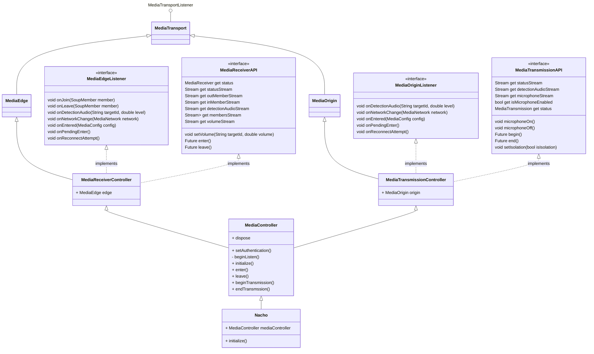

# Media structure

```mermaid
    classDiagram
    MediaTransport <|-- MediaEdge
    MediaTransport <|-- MediaOrigin
    MediaEdge <|-- MediaReceiverController
    MediaOrigin <|-- MediaTransmissionController
    MediaEdgeListener <|.. MediaReceiverController : implements
    MediaOriginListener <|.. MediaTransmissionController : implements
    MediaReceiverAPI <|.. MediaReceiverController : implements
    MediaTransmissionAPI <|.. MediaTransmissionController : implements
    MediaTransportListener ()-- MediaTransport
    MediaReceiverController <|-- MediaController
    MediaTransmissionController <|-- MediaController
    MediaController <|-- Nacho

    class MediaTransport {

    }

    class MediaEdge {

    }

    class MediaOrigin {

    }

    class MediaReceiverAPI {
        <<interface>>
        MediaReceiver get status
        Stream<MediaReceiver> get statusStream
        Stream<SoupMember> get outMemberStream
        Stream<SoupMember> get inMemberStream
        Stream<SoupAudioLevel> get detectionAudioStream
        Stream<List<SoupMember>> get membersStream
        Stream<SoupVolume> get volumeStream
        void setVolume(String targetId, double volume)
        Future<MediaResult> enter()
        Future<MediaResult> leave()
    }

    class MediaTransmissionAPI {
        <<interface>>
        Stream<MediaTransmission> get statusStream
        Stream<SoupAudioLevel> get detectionAudioStream
        Stream<bool> get microphoneStream
        bool get isMicrophoneEnabled
        MediaTransmission get status

        void microphoneOn()
        void microphoneOff()

        Future<MediaResult> begin()
        Future<MediaResult> end()
        void setIsolation(bool isIsolation)
    }

    class MediaEdgeListener {
        <<interface>>
        void onJoin(SoupMember member)
        void onLeave(SoupMember member)
        void onDetectionAudio(String targetId, double level)
        void onNetworkChange(MediaNetwork network)
        void onEntered(MediaConfig config)
        void onPendingEnter()
        void onReconnectAttempt()
    }

    class MediaOriginListener {
        <<interface>>
        void onDetectionAudio(String targetId, double level)
        void onNetworkChange(MediaNetwork network)
        void onEntered(MediaConfig config)
        void onPendingEnter()
        void onReconnectAttempt()
    }

    class MediaReceiverController {
        + MediaEdge edge
    }

    class MediaTransmissionController {
        + MediaOrigin origin
    }

    class MediaController {
        + setAuthentication()
        - beginListen()
        + initialize()
        + enter()
        + leave()
        + beginTransmission()
        + endTransmssion()
        + dispose
    }

    class Nacho {
        + MediaController mediaController
        + initialize()
    }

```