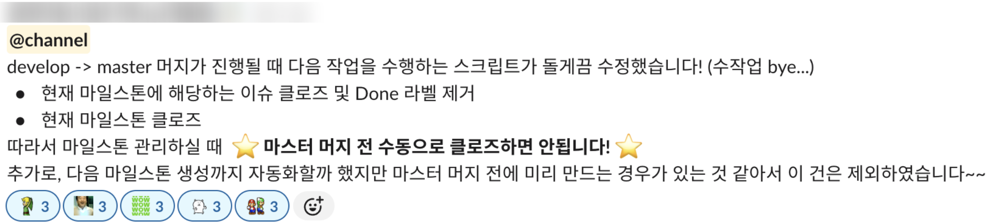

# 마일스톤 관리 자동화: GitLab API를 활용한 개발 프로세스 개선

## 기존 개발 프로세스와 한계

우리 팀의 개발 프로세스는 마일스톤 중심으로 운영됩니다. 각 마일스톤은 프로젝트의 주요 단계를 정의하며, 팀은 이를 기반으로 작업을 계획하고 실행하고 있습니다. 마일스톤 관리 도구로는 Gitlab에서 제공하는 기능을 사용합니다. 프로세스는 다음과 같이 진행됩니다. 

1. **마일스톤 시작**: 새로운 마일스톤이 생성되며 개발 주기가 시작됩니다.
2. **이슈 등록**: 마일스톤에 맞는 작업 단위를 이슈로 등록합니다.
3. **작업 트래킹**: 마일스톤 내 이슈는 `TO DO`, `DOING`, `DONE` 상태로 관리되며 진행 상황을 추적합니다.
4. **마일스톤 종료**: 주기가 끝나면 이슈를 `CLOSED`로 변경하고 `DONE` 라벨을 제거합니다.

그러나 이 과정에서 마일스톤 종료 단계는 수동으로 처리되었습니다. 팀원이 직접 GitLab에 접속해 마일스톤을 닫고, 관련 이슈를 일일이 확인하며 상태를 변경하고 라벨을 정리해야 했습니다. 이 작업은 단순 반복적이면서도 시간이 소요되었고, 특히 마일스톤에 속한 이슈가 많을수록 실수 가능성이 커졌습니다. 더 효율적인 방법을 찾는 것이 필요했습니다.

## 자동화의 필요성과 GitLab API 활용

수동 작업의 비효율성을 줄이고 팀의 생산성을 높이기 위해, GitLab API를 활용한 자동화 스크립트를 개발하기로 했습니다. GitLab API를 통해 프로젝트, 그룹, 마일스톤, 이슈 등의 다양한 데이터를 받아올 수 있습니다. 이를 통해 다음과 같은 작업을 자동화할 수 있었습니다.

- **이슈 상태 변경**: 마일스톤 내 모든 이슈를 `CLOSED` 상태로 업데이트합니다.
- **라벨 정리**: `DONE` 라벨을 제거해 다음 마일스톤에서 혼선을 방지합니다.
- **마일스톤 종료**: `active` 상태의 마일스톤을 찾아 `closed`로 전환합니다.

## 개선 과정

### 1. 요구사항 정의

팀의 워크플로우를 분석해 자동화 대상 작업을 정의합니다.

1. 가장 오래된 `active` 마일스톤을 식별합니다.
2. 해당 마일스톤의 이슈를 모두 조회합니다.
3. 이슈를 `CLOSED`로 변경하고 `DONE` 라벨 제거합니다.
4. 마일스톤을 `closed` 상태로 업데이트합니다.

### 2. GitLab API

GitLab API 문서를 참고해 필요한 엔드포인트를 파악했습니다. 

- `GET /groups/:id/milestones?state=active`: 활성 마일스톤을 조회합니다. 마일스톤이 그룹 단위인지, 프로젝트 단위인지에 따라 도메인이 `groups` / `projects`로 나뉩니다. 우리 프로젝트의 경우 그룹 단위 마일스톤을 사용하여 groups API를 활용하였습니다.
- `GET /groups/:id/milestones/:milestone_id/issues`: 마일스톤 내 이슈를 조회합니다.
- `PUT /projects/:id/issues/:issue_iid`: 이슈 상태 및 라벨 수정합니다.
- `PUT /groups/:id/milestones/:milestone_id`: 마일스톤 상태를 변경합니다.

파라미터 정보를 포함하는 자세한 정보는 [Gitlab API 공식 문서](https://docs.gitlab.com/api/rest/)에서 확인할 수 있습니다.

### 3. 구현 및 테스트

Python과 `requests` 라이브러리를 사용해 스크립트를 작성하였으며 다음과 같은 로직으로 구성됩니다.

- `get_most_recent_milestone`: 활성 마일스톤 중 오래된 것을 찾아 반환합니다.
활성 마일스톤 중 '가장 오래된 것'이라는 필터를 둔 까닭은, 여러 상황 등으로 인하여 마감 일정이 지연되어 다음 마일스톤이 자동으로 시작되었지만 현재 마일스톤이 아직 마무리되지 못하며 여전히 active 상태로 남아있는 상황이 있기 때문입니다. 이와 같은 상황에서 활성 마일스톤 목록이 여러 개가 반환될 수 있으므로, `start_date`가 그 중 오래된 것을 가져오도록 했습니다.
- `get_all_milestone_issues`: 그룹 수준에서 마일스톤의 이슈를 페이지네이션으로 조회합니다.
- `update_issue_status_and_labels`: 각 이슈의 상태를 `closed`로 변경하고 `done` 라벨을 제거합니다.
- `close_milestone`: 현재 진행중인 마일스톤을 `closed` 상태로 변경합니다.

테스트 중 몇 가지 예외 조건을 발견하여 추가하였습니다.

- **`start_date` 누락 고려**: 마일스톤에서 `start_date`을 누락하는 예외 상황을 고려하여 `title` 숫자로 폴백하도록 조정합니다. 우리 팀의 경우 milestone title이 `15`, `16`과 같은 숫자로 구성됩니다. 만약 다음 마일스톤 생성 과정까지 코드로 자동화한다면 이러한 예외 상황은 발생하지 않겠지만, 우리 팀의 경우 마일스톤 생성 작업은 유동적으로 진행하는 상황이 있어 해당 부분은 자동화를 진행하지 않고, 이처럼 마일스톤 생성자의 실수를 방지하기 위한 예외 처리를 추가하였습니다.
- **`403 Forbidden`**: 마일스톤이 그룹 단위로 설정된 경우, `Maintainer` 이상의 권한을 가진 토큰이 필요합니다. 프로젝트 내의 토큰 사용 시 권한 에러가 발생하므로 그룹 단위 토큰을 생성하여야 합니다.

### 4. CI/CD 통합

우리 팀의 경우 develop 브랜치에서 master 브랜치로의 병합이 이루어질 때를 마일스톤의 공식적인 종료로 간주하여, CI 파이프라인에 다음과 같은 조건을 추가했습니다. 마일스톤의 종료될 시점은 병합된 이후이므로 `$CI_MERGE_REQUEST_MERGED == "true"` 조건이 필요합니다.

```yml
close_issue:
  stage: 'close-issue'
  extends: .default-python-job
  rules:
    - if: '$CI_PIPELINE_SOURCE == "merge_request_event" && $CI_MERGE_REQUEST_TARGET_BRANCH_NAME == "master" && $CI_MERGE_REQUEST_MERGED == "true"'
  script:
    - python3 ./script/milestone_mangement.py
```

팀의 브랜치 전략에 따라, develop 브랜치에서 master 브랜치로의 병합이 꼭 마일스톤 종료를 의미하는 것이 아닐 수도 있습니다. 예를 들면 릴리즈 버전의 hotfix가 발생하여 마일스톤 진행 도중 master에 머지하는 상황이 있을 수 있을 것입니다.

이처럼 세밀한 조정이 필요하다면 릴리즈 태그를 부여하는 MR 생성 시 `end-milestone`와 같은 라벨을 추가하도록 하고, 해당 MR의 전체 라벨을 조회한 뒤 라벨 목록이 `end-milestone` 라벨을 포함한다면 스크립트를 실행시키는 방식으로 예외 처리를 고려해볼 수 있습니다.

### 결과와 이점

이 자동화 스크립트를 통해 다음과 같은 개선을 달성할 수 있었습니다.

- **시간 절약**: 수십 개 이슈를 수동으로 처리하던 시간을 비약적으로 줄였습니다.
- **오류 감소**: 사람이 실수로 이슈를 놓치거나 라벨을 잘못 정리할 가능성이 사라졌습니다.
- **일관성 유지**: 모든 마일스톤과 이슈가 동일한 방식으로 처리되어 상태 관리가 깔끔해졌습니다.

### 추가 고려사항

- **다음 마일스톤 생성 자동화**: 마일스톤을 닫은 후 다음 마일스톤을 생성하는 과정까지 전체 프로세스를 자동화할 수 있습니다. 앞서 언급했듯 우리 팀의 경우 마일스톤이 종료되기 전(즉, `develop` -> `master` 머지가 발생하기 전) 이번 마일스톤에서 처리할 수 없는 이슈는 다음 마일스톤으로 변경하면서 마일스톤을 새로 생성하는 경우가 있어, 이 부분은 보류하였습니다.
- **알림 추가**: Slack 웹훅과 같은 기능을 활용하여 마일스톤 종료를 팀에 알리는 기능을 추가할 수 있습니다.



